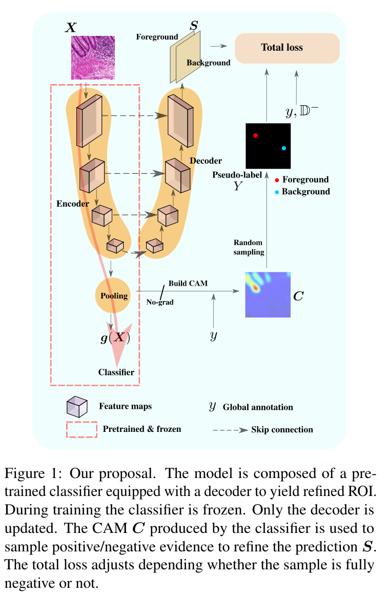
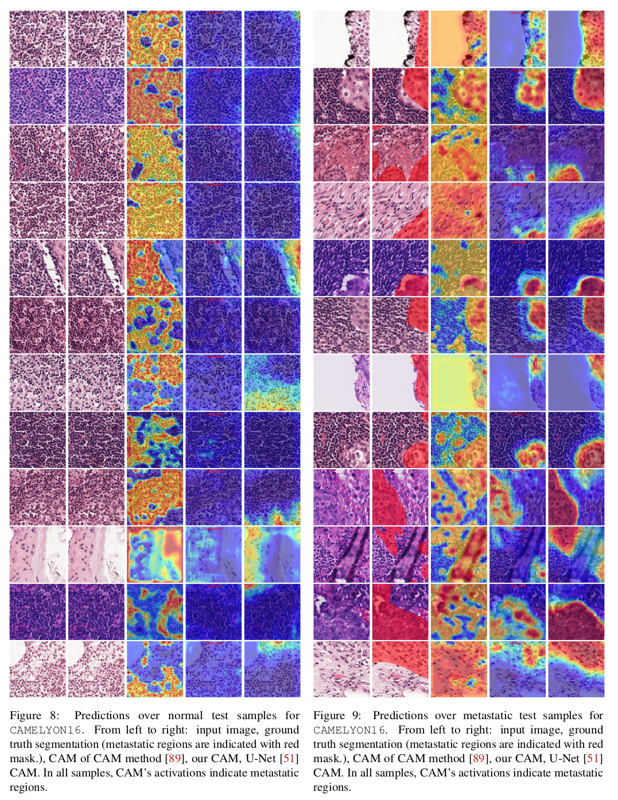

### Pytorch 1.10.0 code for:
`Negative Evidence Matters in Interpretable Histology Image Classification` ([https://arxiv.
org/abs/2201.02445](https://arxiv.org/abs/2201.02445))

### Citation:
```
@article{negevsbelharbi2021,
  title={Negative Evidence Matters  in Interpretable Histology Image Classification},
  author={Belharbi, S. and  Pedersoli, M and
  Ben Ayed, I. and McCaffrey, L. and Granger, E.},
  journal={CoRR},
  volume={abs/xxxx.xxxxx},
  year={2021}
}
```

### Issues:
Please create a github issue.


### Content:
* [Method](#method)
* [Results](#results)
* [Requirements](#re2q)
* [Datasets](#datasets)
* [Run code](#run)


#### <a name='method'> Method</a>:


#### <a name='results'> Results</a>:




#### <a name='reqs'> Requirements</a>:

* Python 3.7.10
* [Pytorch](https://github.com/pytorch/pytorch)  1.10.0
* [torchvision](https://github.com/pytorch/vision) 0.11.1
```shell
pip install torch==1.10.0 -f https://download.pytorch.org/whl/cu111/torch-1.10.0%2Bcu111-cp37-cp37m-linux_x86_64.whl
pip install torchvision==0.11.1 -f https://download.pytorch.org/whl/cu111/torchvision-0.11.1%2Bcu111-cp37-cp37m-linux_x86_64.whl
```
* [Full dependencies](dependencies/requirements.txt)
* Build and install CRF:
    * Install [Swig](http://www.swig.org/index.php)
    * CRF (not used in this work, but it is part of the code.)

```shell
cdir=$(pwd)
cd dlib/crf/crfwrapper/bilateralfilter
swig -python -c++ bilateralfilter.i
python setup.py install
cd $cdir
cd dlib/crf/crfwrapper/colorbilateralfilter
swig -python -c++ colorbilateralfilter.i
python setup.py install
```

#### <a name="datasets"> Download datasets </a>:
#### 2.1. Links to dataset:
* [GlaS](https://warwick.ac.uk/fac/sci/dcs/research/tia/glascontest)
* [Camelyon16](https://github.com/jeromerony/survey_wsl_histology)


#### 2.2. Download datasets:

* GlaS: [./download-glas-dataset.sh](./download-glas-dataset.sh).

You find the splits in [./folds](./folds).

#### <a name="datasets"> Run code </a>:

* CAM-method: CAM over GLAS using ResNet50:
```shell
cudaid=$1
export CUDA_VISIBLE_DEVICES=$cudaid
getfreeport() {
freeport=$(python -c 'import socket; s=socket.socket(); s.bind(("", 0)); print(s.getsockname()[1]); s.close()')
}
export OMP_NUM_THREADS=50
export NCCL_BLOCKING_WAIT=1
plaunch=$(python -c "from os import path; import torch; print(path.join(path.dirname(torch.__file__), 'distributed', 'launch.py'))")
getfreeport
torchrun --nnodes=1 --node_rank=0 --nproc_per_node=1  \
                         --master_port=$freeport main_wsol.py \ --local_world_size=1 \
                         --task STD_CL \
                         --encoder_name resnet50 \
                         --arch STDClassifier \
                         --runmode final-mode \
                         --opt__name_optimizer sgd \
                         --batch_size 32 \
                         --eval_checkpoint_type best_localization \
                         --opt__step_size 250 \
                         --opt__gamma 0.1 \
                         --max_epochs 1000 \
                         --freeze_cl False \
                         --support_background True \
                         --method CAM \
                         --spatial_pooling WGAP \
                         --dataset GLAS \
                         --fold 0 \
                         --cudaid 0 \
                         --debug_subfolder None \
                         --amp True \
                         --opt__lr 0.003 \
                         --exp_id 11_19_2021_09_32_36_109051__423849
```

* NEGEV-method: over GLAS using ResNet50:
```shell
cudaid=$1
export CUDA_VISIBLE_DEVICES=$cudaid
getfreeport() {
freeport=$(python -c 'import socket; s=socket.socket(); s.bind(("", 0)); print(s.getsockname()[1]); s.close()')
}
export OMP_NUM_THREADS=50
export NCCL_BLOCKING_WAIT=1
plaunch=$(python -c "from os import path; import torch; print(path.join(path.dirname(torch.__file__), 'distributed', 'launch.py'))")
getfreeport
torchrun --nnodes=1 --node_rank=0 --nproc_per_node=1 \
                         --master_port=$freeport main_wsol.py \ --local_world_size=1 \
                         --task NEGEV \
                         --world_size 1 \
                         --task NEGEV \
                         --encoder_name resnet50 \
                         --arch UnetNEGEV \
                         --runmode final-mode \
                         --opt__name_optimizer sgd \
                         --dist_backend mpi \
                         --batch_size 32 \
                         --eval_checkpoint_type best_localization \
                         --opt__step_size 250 \
                         --opt__gamma 0.1 \
                         --max_epochs 1000 \
                         --freeze_cl True \
                         --support_background True \
                         --method CAM \
                         --spatial_pooling WGAP \
                         --dataset GLAS \
                         --fold 0 \
                         --cudaid 0 \
                         --debug_subfolder None \
                         --amp True \
                         --opt__lr 0.1 \
                         --negev_ptretrained_cl_cp best_localization \
                         --elb_init_t 1.0 \
                         --elb_max_t 10.0 \
                         --elb_mulcoef 1.01 \
                         --sl_ng True \
                         --sl_ng_seeder probability_seeder \
                         --sl_ng_lambda 1.0 \
                         --sl_ng_start_ep 0 \
                         --sl_ng_end_ep -1 \
                         --sl_ng_min 1 \
                         --sl_ng_max 1 \
                         --sl_ng_ksz 3 \
                         --crf_ng False \
                         --jcrf_ng False \
                         --neg_samples_ng False \
                         --max_sizepos_ng False \
                         --exp_id 12_13_2021_00_49_48_796469__3314599
```

* Train the CAM-method first. Then, copy the best model from the exp folder
  into the folder [./pretrained](./pretrained). Copy the whole folder with this name format `GLAS-0-resnet50-CAM-WGAP-cp_best_localization`.
