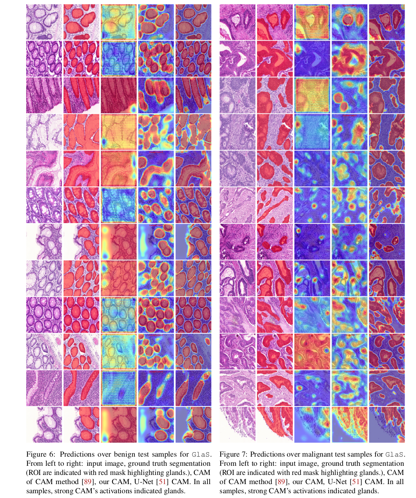

# [Negative Evidence Matters in Interpretable Histology Image Classification (MIDL2024)](https://arxiv.org/pdf/2201.02445)


by
**Soufiane Belharbi<sup>1</sup>,
Marco Pedersoli<sup>1</sup>,
Ismail Ben Ayed<sup>1</sup>,
Luke McCaffrey<sup>2</sup>,
Eric Granger<sup>1</sup>**


<sup>1</sup> LIVIA, Dept. of Systems Engineering, ÉTS, Montreal, Canada
<br/>
<sup>2</sup> Goodman Cancer Research Centre, Dept. of Oncology, McGill University, Montreal, Canada

<p align="center"></p>

[](https://arxiv.org/pdf/2201.02445)
[](/doc/slides.pdf)
[](https://drive.google.com/file/d/1akxwosPIVt2QpyPugIA0FIJwjBeEyuJj/view?usp=sharing)
[](/doc/poster.pdf)

## Abstract
Using only global image-class labels, weakly-supervised learning methods, such as class activation mapping, allow training CNNs to jointly classify an image, and locate regions of interest associated with the predicted class.
However, without any guidance at the pixel level, such methods may yield inaccurate regions. This problem is known to be more challenging with histology images than with natural ones, since objects are less salient, structures have more variations, and foreground and background regions have stronger similarities. Therefore, computer vision methods for visual interpretation of CNNs may not directly apply.
In this paper, a simple yet efficient method based on a composite loss is proposed to learn information from the fully negative samples (i.e., samples without positive regions), and thereby reduce false positives/negatives. Our new loss function contains two complementary terms: the first exploits positive evidence collected from the CNN classifier, while the second leverages the fully negative samples from training data. In particular, a pre-trained CNN is equipped with a decoder that allows refining the regions of interest. The CNN is exploited to collect both positive and negative evidence at the pixel level to train the decoder. Our method called NEGEV benefits from the fully negative samples that naturally occur in the data, without any additional supervision signals beyond image-class labels.
Extensive experiments [github.com/sbelharbi/negev](https://github.com/sbelharbi/negev) show that our proposed method can substantial outperform related state-of-art methods on GlaS (public benchmark for colon cancer), and Camelyon16 (patch-based benchmark for breast cancer using three different backbones). Our results highlight the benefits of using both positive and negative evidence, the first obtained from a classifier, and the other naturally available in datasets.


**Code: Pytorch 1.10.0. This branch supports multi-gpu. In case of issues related to distributed, you can use the branch [main-no-distribute](https://github.com/sbelharbi/negev/blob/main-no-distribute) which runs on single gpu.**

### Citation:
```
@inproceedings{negevsbelharbi2022,
  title={Negative Evidence Matters  in Interpretable Histology Image Classification},
  author={Belharbi, S. and  Pedersoli, M and Ben Ayed, I. and McCaffrey, L. and Granger, E.},
  booktitle = {Medical Imaging with Deep Learning (MIDL)},
  year      = {2022}
}
```


### Content:
* [Method](#method)
* [Results](#results)
* [Requirements](#reqs)
* [Datasets](#datasets)
* [Run code](#run)


#### <a name='method'> Method</a>:


#### <a name='results'> Results</a>:




#### <a name='reqs'> Requirements</a>:

* Python 3.7.10
* [Pytorch](https://github.com/pytorch/pytorch)  1.10.0
* [torchvision](https://github.com/pytorch/vision) 0.11.1
```shell
pip install torch==1.10.0 -f https://download.pytorch.org/whl/cu111/torch-1.10.0%2Bcu111-cp37-cp37m-linux_x86_64.whl
pip install torchvision==0.11.1 -f https://download.pytorch.org/whl/cu111/torchvision-0.11.1%2Bcu111-cp37-cp37m-linux_x86_64.whl
```
* [Full dependencies](dependencies/requirements.txt)
* Build and install CRF:
    * Install [Swig](http://www.swig.org/index.php)
    * CRF (not used in this work, but it is part of the code.)

```shell
cdir=$(pwd)
cd dlib/crf/crfwrapper/bilateralfilter
swig -python -c++ bilateralfilter.i
python setup.py install
cd $cdir
cd dlib/crf/crfwrapper/colorbilateralfilter
swig -python -c++ colorbilateralfilter.i
python setup.py install
```

#### <a name="datasets"> Download datasets </a>:
#### 2.1. Links to dataset:
* [GlaS](https://warwick.ac.uk/fac/sci/dcs/research/tia/glascontest)
* [Camelyon16](https://github.com/jeromerony/survey_wsl_histology)


#### 2.2. Download datasets:

* GlaS: [./download-glas-dataset.sh](./download-glas-dataset.sh).

You find the splits in [./folds](./folds).

#### <a name="datasets"> Run code </a>:

* CAM-method: CAM over GLAS using ResNet50:
```shell
cudaid=$1
export CUDA_VISIBLE_DEVICES=$cudaid
getfreeport() {
freeport=$(python -c 'import socket; s=socket.socket(); s.bind(("", 0)); print(s.getsockname()[1]); s.close()')
}
export OMP_NUM_THREADS=50
export NCCL_BLOCKING_WAIT=1
plaunch=$(python -c "from os import path; import torch; print(path.join(path.dirname(torch.__file__), 'distributed', 'launch.py'))")
getfreeport
torchrun --nnodes=1 --node_rank=0 --nproc_per_node=1  \
                         --master_port=$freeport main_wsol.py \ --local_world_size=1 \
                         --task STD_CL \
                         --encoder_name resnet50 \
                         --arch STDClassifier \
                         --runmode final-mode \
                         --opt__name_optimizer sgd \
                         --batch_size 32 \
                         --eval_checkpoint_type best_localization \
                         --opt__step_size 250 \
                         --opt__gamma 0.1 \
                         --max_epochs 1000 \
                         --freeze_cl False \
                         --support_background True \
                         --method CAM \
                         --spatial_pooling WGAP \
                         --dataset GLAS \
                         --fold 0 \
                         --cudaid 0 \
                         --debug_subfolder None \
                         --amp True \
                         --opt__lr 0.003 \
                         --exp_id 11_19_2021_09_32_36_109051__423849
```

* NEGEV-method: over GLAS using ResNet50:
```shell
cudaid=$1
export CUDA_VISIBLE_DEVICES=$cudaid
getfreeport() {
freeport=$(python -c 'import socket; s=socket.socket(); s.bind(("", 0)); print(s.getsockname()[1]); s.close()')
}
export OMP_NUM_THREADS=50
export NCCL_BLOCKING_WAIT=1
plaunch=$(python -c "from os import path; import torch; print(path.join(path.dirname(torch.__file__), 'distributed', 'launch.py'))")
getfreeport
torchrun --nnodes=1 --node_rank=0 --nproc_per_node=1 \
                         --master_port=$freeport main_wsol.py \ --local_world_size=1 \
                         --task NEGEV \
                         --world_size 1 \
                         --task NEGEV \
                         --encoder_name resnet50 \
                         --arch UnetNEGEV \
                         --runmode final-mode \
                         --opt__name_optimizer sgd \
                         --dist_backend mpi \
                         --batch_size 32 \
                         --eval_checkpoint_type best_localization \
                         --opt__step_size 250 \
                         --opt__gamma 0.1 \
                         --max_epochs 1000 \
                         --freeze_cl True \
                         --support_background True \
                         --method CAM \
                         --spatial_pooling WGAP \
                         --dataset GLAS \
                         --fold 0 \
                         --cudaid 0 \
                         --debug_subfolder None \
                         --amp True \
                         --opt__lr 0.1 \
                         --negev_ptretrained_cl_cp best_classification \
                         --negev_ptretrained_loc_cp best_localization \
                         --elb_init_t 1.0 \
                         --elb_max_t 10.0 \
                         --elb_mulcoef 1.01 \
                         --sl_ng True \
                         --sl_ng_seeder probability_seeder \
                         --sl_ng_lambda 1.0 \
                         --sl_ng_start_ep 0 \
                         --sl_ng_end_ep -1 \
                         --sl_ng_min 1 \
                         --sl_ng_max 1 \
                         --sl_ng_ksz 3 \
                         --crf_ng False \
                         --jcrf_ng False \
                         --neg_samples_ng False \
                         --max_sizepos_ng False \
                         --exp_id 12_13_2021_00_49_48_796469__3314599
```

* Train the CAM-method first. Then, copy the best model from the exp folder
  into the folder [./pretrained](./pretrained). Copy the whole folder with this name format `GLAS-0-resnet50-CAM-WGAP-cp_best_localization` and `GLAS-0-resnet50-CAM-WGAP-cp_best_classification`.
